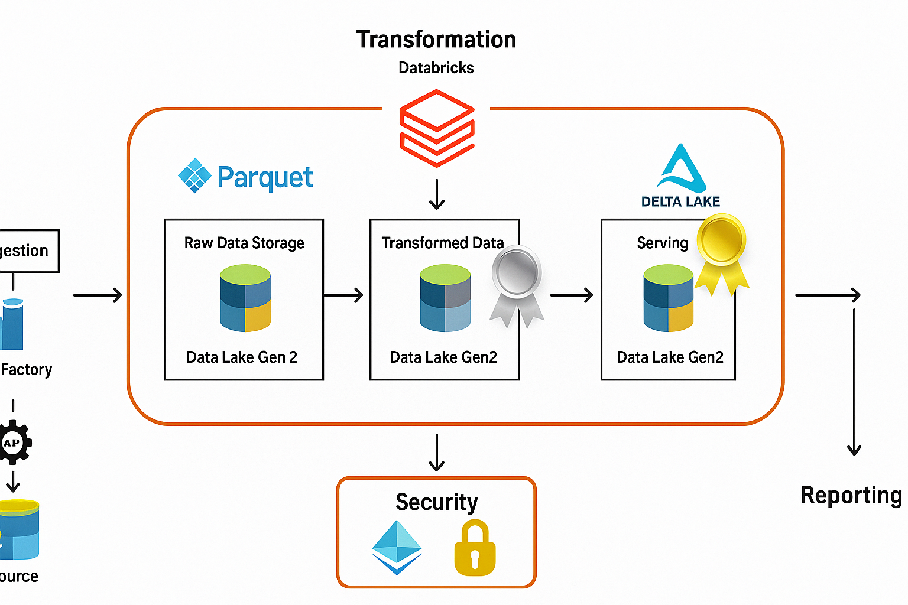

# 🚀 Azure End-to-End Data Engineering Project

This project demonstrates a complete data engineering pipeline built on **Microsoft Azure** using the **NYC Taxi dataset**. It follows the **medallion architecture** (Bronze, Silver, Gold layers) and leverages key Azure services like **Data Factory**, **Databricks**, and **Data Lake Gen2** with **PySpark** and **Delta Lake** for data processing and storage.

---

## 🧰 Technologies Used

- **Azure Data Factory** – Ingest data from API to Data Lake
- **Azure Data Lake Gen2** – Store raw, cleaned and curated data
- **Azure Databricks** – Transform data using PySpark
- **Delta Lake** – ACID-compliant data storage
- **Parquet Format** – Efficient columnar storage format
- **Medallion Architecture** – Bronze (raw), Silver (cleaned), Gold (curated)

---

## 📁 Architecture Overview

Source (API: NYC Taxi Data)
│
▼
Azure Data Factory (Ingestion)
│
▼
Bronze Layer → Raw Data (Parquet)
│
▼
Silver Layer → Cleaned Data (Parquet)
│
▼
Gold Layer → Aggregated Data (Delta Lake)
│
▼
Reporting (Databricks SQL / Power BI)

---

## 🗃️ Dataset

- **NYC Yellow Taxi Trip Records**
- Source: [NYC Taxi & Limousine Commission]([https://www.nyc.gov/site/tlc/about/tlc-trip-record-data.page](https://www.nyc.gov/site/tlc/about/tlc-trip-record-data.page))

---

## 🧠 Key Learnings

- Set up Azure Data Factory for API-based ingestion
- Write scalable transformation logic in Databricks using PySpark
- Store and manage data efficiently using Delta Lake
- Apply Medallion Architecture for a clear and maintainable data flow
- Enable downstream analytics with clean and curated data

---

## 🖼️ Architecture Diagram

